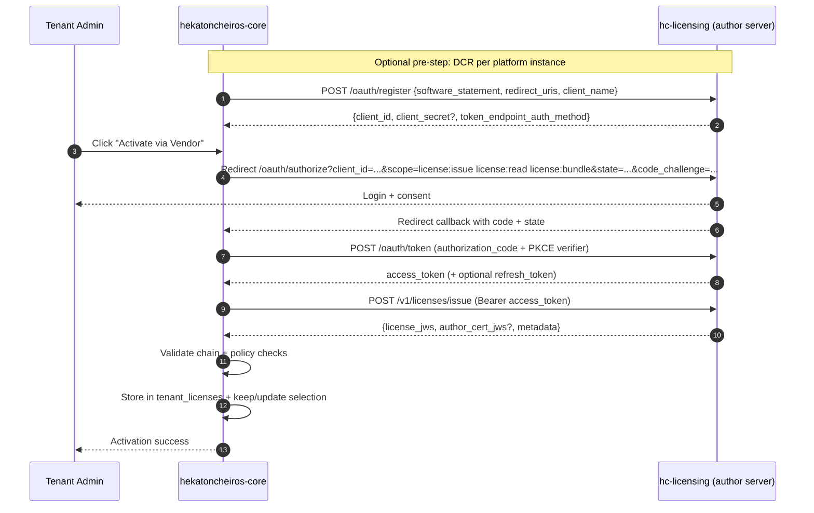

# OAuth Flow (Online Activation)

This document specifies online license activation between core and an author licensing server.

## Protocol profile

- OAuth2 Authorization Code flow
- Dynamic Client Registration (DCR)
- Core registration is **per platform instance** (not per tenant)

Required scopes:

- `license:issue`
- `license:read`
- `license:bundle`

## End-to-end sequence



## Required behavior

1. Core starts OAuth via `/licenses/oauth/start`.
2. Callback is handled at `/licenses/oauth/callback`.
3. Core exchanges code at licensing `/oauth/token`.
4. Core issues/acquires license using `/v1/licenses/issue`.
5. Core stores license and performs local verification.

## DCR security model

`POST /oauth/register` is not anonymous/open.

Registration request includes:

```json
{
  "software_statement": "<signed JWT>",
  "redirect_uris": ["https://core.example.com/api/v1/licenses/oauth/callback"],
  "client_name": "Hekatoncheiros Core"
}
```

`software_statement` (JWS) required claims:

- `platform_instance_id`
- `iss`
- `iat`
- `exp`

Licensing server validates signature before issuing `client_id`.

## Renewal model

- Renewals produce new license JWS with new `jti`.
- Overlap is allowed; old/new licenses may both be active in storage.
- Core selection decides which license is currently effective.
