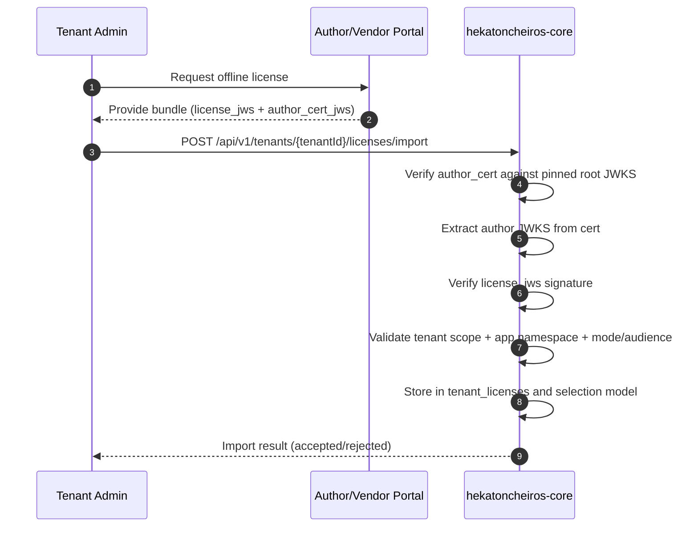

# Offline Flow (Import and Validation)

This document defines offline license delivery/import without runtime dependency on external services.

## Supported import forms

Core supports:

1. `license_jws` (+ optional `author_cert_jws`)
2. Full bundle:

```json
{
  "bundle_typ": "hc-license-bundle",
  "v": 1,
  "license_jws": "<...>",
  "author_cert_jws": "<...>",
  "root_kid": "root_2026_01"
}
```

## Sequence



## Offline revocation behavior

- Offline mode is not guaranteed to receive revocations.
- Optional manual import of `/v1/revocations` snapshots may be supported.
- Without snapshot updates, enforcement relies on token expiration (`exp`).

## Operational guidance

- Prefer shorter expiration windows for high-risk/commercial licenses.
- Use periodic operator process for root JWKS and revocation snapshot updates.
- Record import provenance for audit and troubleshooting.
